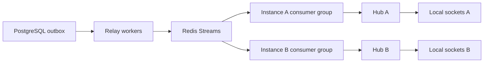

# 09 — Scale and Observability Specification

**Status:** In progress — 09A Done; 09B–09D and external rollout pending

**Priority:** P2

**Execution plan:** [Phase 9 plan](../plan/09-scale-observability.md)

**Depends on:** 01–05; Phase 7 for shared presence/read state; Phase 8 outbox for durable relay; [Phase 6 integration](../plan/06-message-lifecycle.md) for lifecycle convergence

## 1. Outcome and boundaries

Operate multiple application instances without splitting authorized room delivery,
personal events, presence or admission limits. Diagnose failures with bounded
telemetry, explicit recovery and measured staging capacity.

Today each process has one Hub event loop; room sockets, presence, typing,
admission and rate buckets are local. PostgreSQL is durable, broadcasts are best
effort, and startup applies embedded migrations. This specification proposes
changes: no shared infrastructure, new dependency or load result exists yet.

Scope: correlation/telemetry, probes/drain, durable relay, cross-instance delivery
and revocation, shared ephemeral state/limits, fault tests and rollout gates.
Preserve REST contracts, ID cursor pagination, service boundaries and manual
wiring. Attachment bytes and search stay in their Phase 8 stores. Multi-region
writes, browser acknowledgements, public read receipts and exactly-once
application delivery are out of scope.

## 2. Slices and prerequisites

| Slice | Deliverable | Gate |
| --- | --- | --- |
| 09A | Observability, probes, bounded drain, single-instance baseline | May start before Phase 8; existing security/API tests pass |
| 09B | Durable outbox relay and independent instance consumers | Phase 8 outbox integrated; envelope/version contract agreed |
| 09C | Shared presence/typing, limits, authorization recovery | Phase 7 integrated; durable room control producers upgraded; two-node privacy/fault gates pass |
| 09D | Measured rollout, load/fault evidence and recovery runbooks | 09A–09C gates pass; two-instance staging and provider ownership reviewed |

Phase 5 remains Pending for verification; review fixes in current `main` do not
complete that gate. Phase 6/7 app code and AsyncAPI assets are now integrated
from `develop`; distributed lifecycle producer verification remains a 09B gate.

09A implementation and local verification are complete. Phase 8 will be implemented
in a separate session. Distributed contracts below remain target behavior for
09B–09D; provider rollout and sustained SLO evidence are separate release gates.

## 3. Proposed operational baseline

Propose one Redis service for Streams fanout plus short-lived leases and atomic
rate/admission decisions. Provider access, cost, persistence/failover behavior,
version compatibility and staging measurements remain pending. Pin a Go client
compatible with the repository toolchain only when implementation begins; explain
the dependency and keep interfaces limited to real substitution/test needs.
Require a no-eviction policy for lease/admission/control keys; pressure must reject
writes and fail guards closed rather than silently drop live reservations. Bound
streams explicitly and measure headroom. Provider failover must trigger the
authoritative recovery barrier when lease state may be lost; key disappearance
cannot be treated as proof that a user's connections ended.

Redis consumer groups distribute entries among consumers within a group. Therefore
each application instance needs its own group to receive the same durable events;
competing consumers may be appropriate for workers but not local socket fanout.
Pending recovery must handle abandoned delivery and finite retry windows.
[Redis consumer-group semantics](https://redis.io/docs/latest/commands/xreadgroup/), [pending-entry claiming](https://redis.io/docs/latest/commands/xautoclaim/)

Before 09B, record an ADR covering retention, measured fanout/throughput, ownership,
memory, failover, protocol and cost. NATS JetStream is an alternative if independent
filtered consumers/persisted publish acknowledgements justify another service;
Kafka is an alternative if retained partitioned processing by many independent
systems becomes a measured requirement. Do not implement three broker adapters.
JetStream also needs one durable consumer per instance and explicit duplicate
handling. [NATS consumer state and filtering](https://github.com/nats-io/nats.docs/blob/master/nats-concepts/jetstream/consumers.md), [JetStream publication acknowledgements](https://docs.nats.io/using-nats/developer/develop_jetstream)

## 4. Durable event and outbox contract

Reuse Phase 8 `domain_outbox` and independent per-purpose delivery records. The
mutation, event intent and aggregate sequence commit in the same PostgreSQL
transaction; failed intent insertion rolls back the mutation. Relay progress must
not steal notification/cleanup work, and cleanup respects every consumer horizon.

Shared envelope: stable random 128-bit `event_id` string, `schema_version=1`,
`kind`, `occurred_at`, `aggregate_type`, `aggregate_id`, `aggregate_seq`,
`aggregate_version`, optional numeric `room_id`/`user_id` targets and typed
payload references. Resource version (message revision) differs from sequence.
Bounded validated `traceparent` may link work; arbitrary baggage, copied content,
tokens, signed URLs and provider credentials are forbidden in durable envelopes.

Room-visible message create/edit/delete and membership control share a **room**
aggregate sequence, allocated under the transaction's room/counter lock. Personal
read state, invitations and notifications use the applicable **user** aggregate.
Auto-increment IDs/timestamps do not establish commit order; there is no global
order. Keep current ID-based history/read-watermark semantics: this sequence does
not fix concurrent message-ID commit inversion or replace pagination.

Relay workers serialize an aggregate with a dedicated PostgreSQL advisory lock,
read pending sequences, publish a stable ID and await the selected broker's
acceptance/persistence policy before marking relay progress. A lost reply/crash
before marking permits retries. Redis `XADD` success is acceptance, not proof of
disk/replica survival; the ADR must choose and test AOF/replication policy. `WAIT`
improves replication acknowledgement but does not establish strong consistency.
Keep PostgreSQL intents through the recovery horizon and support re-driving a new
transport epoch after stream loss. Never mark from fire-and-forget Pub/Sub.
[Redis persistence tradeoffs](https://redis.io/docs/latest/operate/oss_and_stack/management/persistence/), [Redis WAIT guarantees](https://redis.io/docs/latest/commands/wait/)

Use bounded deadlines, backoff/jitter and explicit lock/connection release. Session
advisory locks survive transaction rollback; returning a locked connection to the
pool is unsafe. A lost DB session can leave a network publish in flight: use a
publisher fencing generation and consumer sequence/gap reconciliation rather than
promise strict physical publication order. Lease expiry alone cannot grant safe
concurrent publishing. [PostgreSQL advisory locks](https://www.postgresql.org/docs/17/explicit-locking.html#ADVISORY-LOCKS)

Keep the immutable domain envelope separate from its transport wrapper. The wrapper
carries `publisher_generation` (the authoritative PostgreSQL relay fencing value)
and `recovery_incarnation` (the active recovery identity held in PostgreSQL), plus
the domain envelope and `disposition=reference|obsolete` with a fixed safe skip
reason when obsolete. Broker entries contain references/control metadata, never
hydrated message text. Consumers validate both outside the Hub against their current
control state before applying an entry; stale or unknown values suspend/reconcile
rather than grant permission. Re-driving an intent preserves its `event_id` and
sequence but uses the current wrapper. A transport retry does not rewrite domain
history, and a newer publisher generation does not permit skipping sequence gaps.

Poison events stop the ordered aggregate, alert and require an audited dead-letter
unblock decision; unrelated aggregates continue. At-least-once processing plus
bounded dedup/recovery is the application contract, never exactly-once delivery.

## 5. Broker topology and local delivery

Propose bounded room/user streams under an environment + recovery-incarnation
namespace, with typed room/user routing fields; start with one stream per fixed
scope, not one per room/user. Every live instance has its own consumer group on
each required stream, explicit `XACK`, bounded pending entries and reclaim work.
Do not use one shared group for all nodes. Configure finite stream age/size and
group cleanup; trimming must detect gaps rather than silently promise replay.

Each consumer authorizes/hydrates references outside its Hub before local dispatch.

Instance identity is unique among running nodes. A restart resumes a group only
after owning that identity; replacements establish a DB/stream control watermark
before admitting sockets. Live instance leases drive abandoned-group cleanup after
a grace period; deployments must not accumulate groups forever. Optional shard
filters/subject optimization wait until subscription gaps are demonstrated absent.

Readers validate bounded envelopes and hydrate only the exact resource revision
named by `aggregate_version`, outside the Hub. If the current message no longer
has that revision, record a content-free terminal skip at the original sequence;
the relay may already have marked it obsolete. Either outcome advances ordered
processing/ACK without a browser message body or a consumer publishing new history.
Never hydrate newer text at an older sequence, even with a corrected revision
label: create at sequence 10, revoke at 15 and edit at 20 cannot deliver revision
20's body before revocation 15. Deleted/redacted messages never recover old text
from replay. Current content/tombstones come from their own later events or an
authorized snapshot after rebuilding the control watermark. Skip reasons are
fixed safe enums, and unknown/missing state requires reconciliation. Permission-
sensitive attachment URLs are minted by an authorized HTTP retrieval, never
copied into broker entries.

Use a bounded adapter queue and explicit Hub enqueue completion. Consumer ACK means
local dispatch or a recorded terminal skip, not socket/browser receipt. Queue
saturation retries within a bound, then suspends affected realtime admission and
forces resync. Local socket queues remain bounded/best effort with drop/close
metrics. Broker, DB, shared-store and exporter I/O never execute in `Hub.Run`.

Deduplicate stable IDs in a bounded instance TTL cache; restart/eviction can
duplicate events. A bounded atomic Redis ID-to-stream-entry script may reduce
publish duplicates but cannot remove the application's retry duty. Apply sequence
gates and revision/read-max rules independently; hold gaps in a bounded buffer,
then suspend/resync rather than apply data across missing revocation control.
Existing WS `type`, string `room_id` and `payload` remain intact. Optional additive
server fields are `event_id`, `schema_version`, `aggregate_type`, `aggregate_id`
and `aggregate_seq`; message revision remains in its DTO. Transport fencing fields
stay internal. Update contract fixtures and verify existing clients tolerate the
additions before enabling them; client commands cannot supply server metadata.
Reconnect rejoins and reloads authorized
history/presence/read state/notifications. Equal read cursors can still have stale
unread counts, so fetch authoritative state after a suspected gap.

## 6. Cross-instance authorization and privacy

Persist membership leave/removal, role/ownership changes, account deletion and
applicable personal state/invitation events with the same ordered outbox contract.
Services enforce DB authorization; routing fields are not permissions. Broker/store
credentials are server-only and minimally scoped, never given to clients.

Reuse Phase 8 immutable `membership_generation` per membership insertion, separate
from room sequence and local connection authorization generation. Role updates do
not create a new membership generation; leave/rejoin does. An authorization result
includes a transaction-consistent membership generation/control watermark. Before
joining/fanout, reconcile that watermark. Revocation invalidates pending join/typing
and removes local subscriptions. Old generation results cannot restore access.
Process room control and data in sequence: a removed member receives no event
**after the revocation sequence**. Earlier authorized frames already queued to a
writer/network cannot be retracted.

On disconnect, sequence gap, unknown control schema, lost position or excessive
lag, suspend joins/typing/room fanout; invalidate pending work and remove/close
affected subscriptions. Reconnect rebuilds watermarks, reauthorizes DB membership,
clears stale leases and snapshots before enabling traffic. Periodic eventual
revocation alone is insufficient. Verify delayed joins, missed control, lost ACK,
partition, removal/rejoin and account deletion across nodes.

Personal events go only to server-authenticated matching users on every node.
Fence room-scoped read-state and mention notification delivery to the current
membership generation; a delayed event from before leave must not resurrect a
rejoined user's old state. Invitations target nonmembers: validate authoritative
recipient ownership and the exact invitation revision/state instead of requiring
membership. An expired, revoked, superseded or accepted invitation cannot be
rehydrated as a pending invitation at an old user sequence; use a terminal skip
and current authorized inbox recovery. Presence snapshots require current
authorization and filter stale shared leases against current membership with the
same watermark/generation barrier.

## 7. Shared presence, typing and limits

Hub retains sole ownership of its maps. Adapter workers maintain store-time leases
for server-owned instance/connection IDs, user, room and membership generation.
Atomic bounded scripts join/refresh/remove leases and version aggregate transitions.
Redis scripts are atomic but block other work while running; cap key/member work
and validate maximum room/connection capacity before enabling distributed mode.
[Redis atomic scripting](https://redis.io/docs/latest/develop/programmability/eval-intro/)

Online means any unexpired authorized joined connection across nodes. Emit online
only at the first connection and offline only at the final one. Proposed TTL 15 s,
refresh 5 s; a bounded sweeper expires crashed connections within TTL + 1 s. One
tab/instance drain must not hide another. Aggregate transition versions and
snapshots reconcile reordered/missed ephemeral events; unioning local boolean
events is insufficient. Disconnect/removal/token release is idempotent.

Typing keeps Phase 7's 5 s expiry and 1 s start throttle. Global expiry is the
maximum valid per-connection expiry; stopping one tab does not stop another.
Presence/typing are best effort, not historical replay. Store loss returns snapshot
`503`, expires/revokes local validity and requires fresh joins after recovery;
silently returning local-only users is incorrect. Leases contain identifiers and
expiry only, expire promptly and never grant authorization.

Keep `WS_MAX_CONNECTIONS` as a local safety cap. Enforce
`WS_MAX_CONNECTIONS_PER_USER` globally with atomic leased reservations before
upgrade, rollback failed upgrade, renew, and release once. Stop commands/room
output before an unrenewed reservation expires. PostgreSQL holds the authoritative
active recovery incarnation; Redis is a cache of leases stamped with that identity,
never the source that decides whether old reservations remain valid. Store
restart/failover atomically advances the PostgreSQL incarnation, pauses admission
and drains old connections. Renewals must prove the active incarnation under a
bounded deadline, including when a partitioned old Redis remains reachable.
Before new reservations, obtain old-node drain acknowledgements or wait the maximum
previous reservation TTL plus a measured safety margin covering incarnation-check,
in-flight renewal, clock and local-drain bounds. Lost reservations cannot silently
double admission. Nodes that cannot prove validity fail closed; an old socket
cannot resume commands/output on process recovery without a new valid reservation.
Lease validity is checked outside Hub and applied as ordered local control, with
bounded renewal/drain work. Document the validity-based admission cap separately
from physical TCP sockets that may outlive a partition.

Use shared token buckets for auth attempts, authenticated writes and WS upgrades;
retain local frame/memory bounds. Keys use authenticated identity or trusted peer
policy, not client IDs/unchecked forwarding headers. Bound key count and TTL.
Exhaustion remains `429` + `Retry-After`; unavailable shared guard returns `503`,
not unlimited permission. Reads without that dependency continue. With one Redis
service, a broker outage may also disable shared guards: document those route
failures instead of claiming every HTTP write always survives broker loss.

## 8. Telemetry and objectives

Keep zerolog with production JSON. Correlate validated request ID, generated
connection ID, trace ID and event ID in restricted logs. Never capture body, raw
query/token, DSN, signed URL, private filename/email or unsafe exporter/driver
error text. IDs useful for bounded incident lookup are logs, not metric labels.
Document access/retention and use fixed safe error categories.

OpenTelemetry spans cover HTTP → service → repository → outbox, with links to
relay/consumer work; propagate only bounded validated W3C tracecontext. Disable
baggage/body/SQL-argument capture. Sampling/export queues are bounded; exporter
loss does not block or fail business requests.
[OpenTelemetry Go](https://opentelemetry.io/docs/languages/go/), [trace-context propagation](https://pkg.go.dev/go.opentelemetry.io/otel/propagation)

Prometheus access is private/authenticated; no public diagnostics/pprof. Use fixed
enums and route templates, never user/room/event/connection/IP/raw path labels.
Unbounded labels create unbounded series. [Prometheus label guidance](https://prometheus.io/docs/practices/naming/)

| Metric family | Type / allowed labels |
| --- | --- |
| HTTP requests/duration | Counter/histogram: method, route template, status class |
| DB pool open/in-use/waits | Gauge/counter: fixed pool role |
| WS connections/queue depth/drops | Gauge/counter: fixed queue, reason |
| Outbox pending/oldest/retries | Gauge/counter: fixed consumer purpose, kind |
| Broker lag/duplicates/gaps | Histogram/counter: fixed stream scope, result |
| Lease expiry/admission rejects | Counter: fixed operation, reason |
| Notification attempts | Phase 8 metric: fixed channel, result |
| Exporter drops | Counter: fixed signal, reason |

Proposed initial targets over rolling 30 days; capacity/SLO evidence is pending:

| Objective | Eligible denominator / good outcome |
| --- | --- |
| HTTP availability 99.9% | Valid authenticated requests; expected 4xx excluded, service-caused 429/503 included as failures |
| HTTP p95 ≤ 300 ms | Successful non-upload APIs; publish route-wise latency/DB wait |
| Realtime 99% ≤ 1 s | Each committed event × eligible instance-local dispatch; local enqueue within 1 s is good, dropped/undelivered dispatch is bad |
| Crash presence expiry ≤ 16 s | Final crashed connection becomes offline within lease + sweep; staging synthetic checks |

Enqueue is not WS write or browser receipt. Separate commit/relay age, broker lag,
hydration and queue delay; synchronize clocks and record timing uncertainty.
An event with eligible subscribers on two instances contributes two dispatch
attempts; success on one cannot hide a failed second dispatch. Define eligibility
from authorized subscriptions at the applicable control sequence and reconcile
expected live-consumer attempts, including missing ACKs/node failure; counting only
observed successful deliveries cannot measure this SLO. Keep instance/event IDs
out of metric labels and use restricted correlation records for reconciliation.
Phase 8 notification latency ends at its defined inbox/provider acceptance, not
presumed display. Dashboards cover errors, DB/Hub saturation, outbox age and
control gaps; alerts cover sustained budget burn, oldest pending > 30 s, queue
drops and lease/store loss. Test firing and recovery with synthetic failures.

## 9. Probes, startup and drain

Preserve `GET /health` status/body. Add `/livez` (200 when process responds;
dependencies cannot fail it) and `/readyz` (200/503 for HTTP: boot/migrations
complete, DB accessible, required outbox schema usable, not draining). Return safe
booleans only. Expose realtime readiness separately and return 503 at WS admission
before upgrade when unsafe. Broker loss pauses realtime/relay; HTTP mutations may
commit intents when their DB and shared-guard dependencies are healthy. Do not
make global HTTP readiness broker-dependent and evict otherwise usable producers.
Probe timeouts/cache are bounded; telemetry exporter loss is never a probe failure.

Verify golang-migrate PostgreSQL advisory locking and bounded lock wait under
simultaneous startup; do not blindly add another lock. Apply new numbered expand
migrations before traffic, check binary/schema and consumer-version compatibility,
then establish watermarks/store generation before WS. Destructive/contract
migrations require a separate gated rollout after old binaries leave.

SIGTERM immediately marks HTTP not ready and stops WS/worker admission. One 15 s
budget covers transactions, stop-claim/lease release, bounded adapter/Hub drain,
close code 1001 through the sole WritePump, pump completion, shared-lease cleanup,
bounded telemetry flush and dependency close. Force close at deadline and count
it. No second WS writer; unfinished durable intents survive. Clients reconnect
with backoff/jitter, fresh joins and snapshots.

## 10. Configuration, rollout and acceptance

Proposed settings; implement/validate only with each slice:

| Settings | Default / validation |
| --- | --- |
| `REALTIME_MODE` | `local`; distributed requires 09B/09C gates/dependencies |
| `REDIS_URL`, `EVENT_NAMESPACE`, `INSTANCE_ID` | Distributed required; TLS/auth, environment/incarnation namespace, server-owned unique identity; never log secrets |
| `PRESENCE_LEASE_TTL`, `PRESENCE_REFRESH_INTERVAL` | `15s`, `5s`; TTL > 2 × refresh |
| `BROKER_ACK_TIMEOUT`, `REALTIME_MAX_LAG` | `3s`, `5s`; bounded; any detected gap suspends immediately |
| `EVENT_DEDUP_TTL`, `EVENT_DEDUP_MAX_ENTRIES` | `10m`, `100000`; bounded by memory/replay evidence |
| `OTEL_SERVICE_NAME`, `OTEL_EXPORTER_OTLP_ENDPOINT` | `gogo-dl`; endpoint optional locally, no sensitive query |
| `OTEL_EXPORTER_OTLP_HEADERS` | Empty; secret comma-separated HTTP headers; no logging |
| `TRACE_SAMPLE_RATIO`, `METRICS_ENABLED`, `METRICS_LISTEN_ADDR` | `0.05`, `false`, private bind; ratio 0–1, public exposure forbidden |
| `SHUTDOWN_TIMEOUT` | `15s`; within chosen platform termination grace |

Each new value requires Config/validation/tests, `.env.example`, container wiring
and README. ADR must set stream age/size, group cleanup, maximum room size and
store budget from measurements. Verify provider network/persistence/shutdown
constraints at implementation time; Render Free single-instance staging does not
prove production scale. No production provisioning/access is requested here.

### 09D — Rollout and recovery evidence

Rollout: 09A one instance → expand/outbox one instance → shadow consumers without
double sends → one distributed instance → two staging nodes through privacy/load
fault gates. Upgrade every durable control producer first or pause writes/joins
during cutover; old local-only producers cannot safely coexist. Test additive
schema and mixed consumer versions. Rollback drains to one node and preserves
schema/intents; never run production down or delete the outbox.

Disaster recovery must pause traffic, restore a consistent DB/object state, create
a fresh recovery incarnation in PostgreSQL, clear stale dedup/groups/leases,
rebuild control watermarks and rotate/revalidate sessions as appropriate before
admission. Apply the old-node acknowledgement or maximum-TTL-plus-margin admission
barrier from section 7. Restored lower DB sequences must not collide with retained
old broker events; restored fencing values must never reuse the former namespace.
Document RPO/RTO as measured, with no guessed recovery guarantee.

- [ ] Two nodes receive eligible room/private events without cross-user leaks.
- [ ] Publish loss/crash/redelivery/restart ordering and duplicate recovery pass.
- [ ] Revocation/stale join/gap/partition fail closed across nodes.
- [ ] Shared presence/typing/caps survive lease crash/restart recovery.
- [ ] Broker/shared-guard failures obey HTTP and probe dependency policy.
- [ ] Privacy-safe telemetry/drain and required Go/integration checks pass.
- [ ] Load/soak/fault/DR reports establish capacity and recovery limits.
- [ ] Provider ownership, retention, alerts and cutover are reviewed.

Acceptance remains pending until implementation and measured evidence exist.
